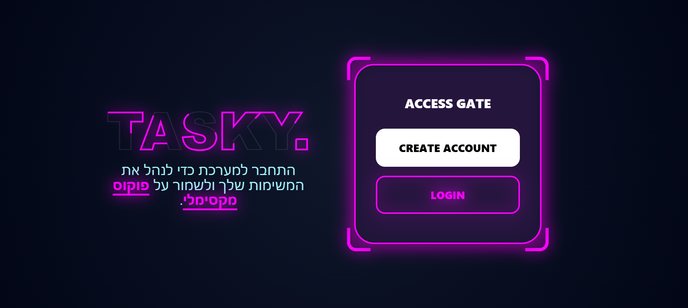
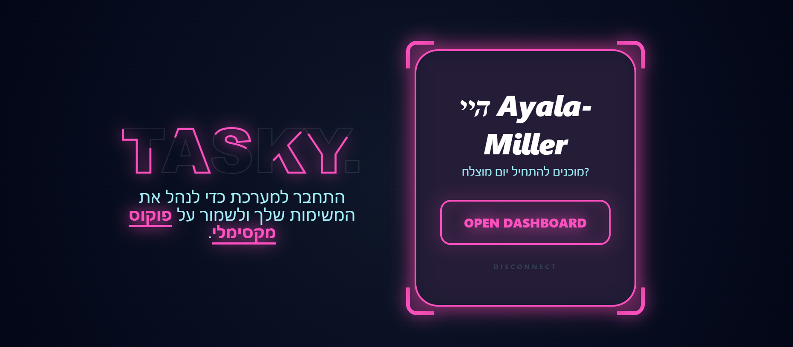
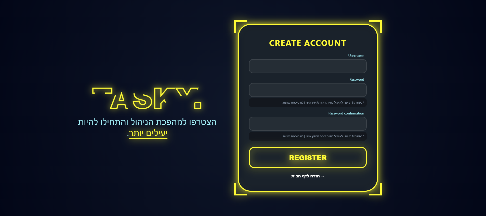
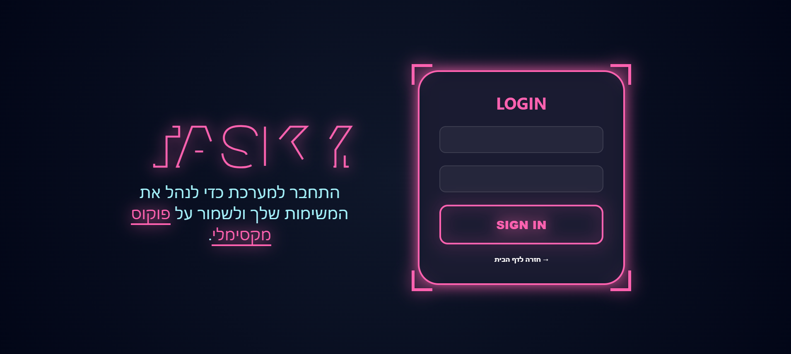
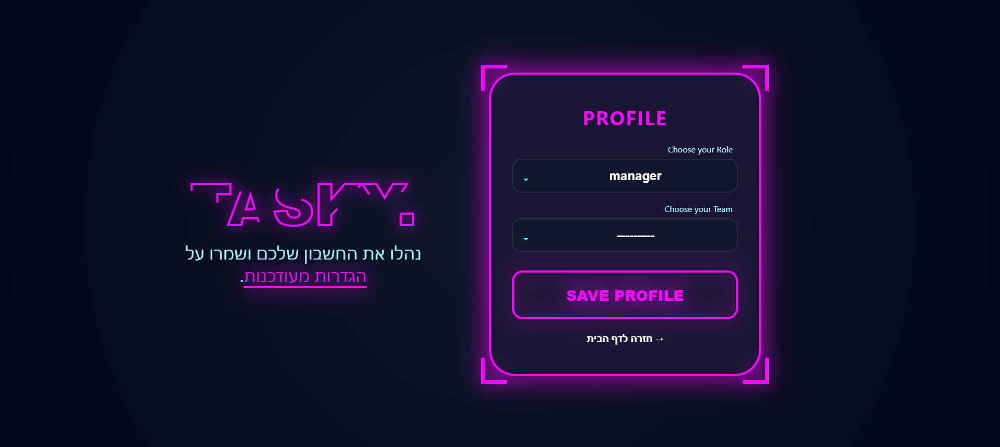
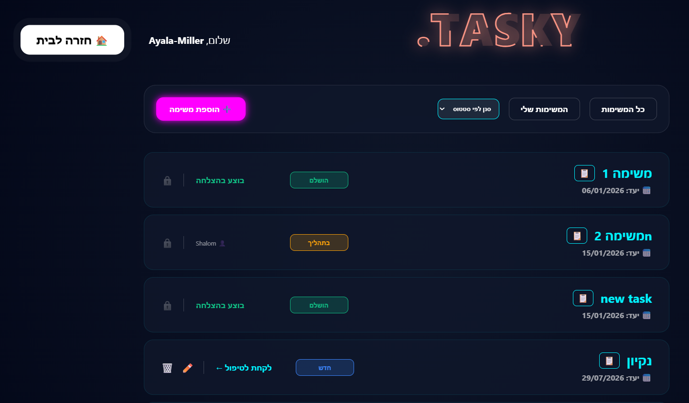

<div dir="rtl" align="right">

# Tasky – מערכת ניהול משימות לצוותים

Tasky היא מערכת ווב לניהול משימות בתוך צוותי עבודה, בנויה בפייתון (Python) עם Django. המערכת מאפשרת למשתמשים להירשם, להצטרף לצוות, ולנהל משימות לפי תפקיד (מנהל / עובד).

**טכנולוגיות:**

- שפת תכנות: Python 3
- Framework: Django 5.2
- בסיס נתונים: SQLite
- עיצוב: HTML, CSS ו-Tailwind CSS

---

## תוכן עניינים

- [תכונות עיקריות](#תכונות-עיקריות)
- [צילומי מסך](#צילומי-מסך)
- [טכנולוגיות](#טכנולוגיות)
- [מבנה הפרויקט](#מבנה-הפרויקט)
- [נתיבי URL](#נתיבי-url)
- [התקנה והרצה](#התקנה-והרצה)
- [תהליך העבודה במערכת](#תהליך-העבודה-במערכת)
- [תפקידים והרשאות](#תפקידים-והרשאות)
- [מודל הנתונים](#מודל-הנתונים)
- [אבטחה](#אבטחה)
- [מיומנויות שמודגמות בפרויקט](#מיומנויות-שמודגמות-בפרויקט)
- [מפתחת](#מפתחת)

---

## תכונות עיקריות

- **הרשמה והתחברות** – מערכת אימות משתמשים מבוססת Django Auth (הרשמה, התחברות, התנתקות).
- **פרופיל משתמש** – בחירת תפקיד (מנהל / עובד) ושיוך לצוות.
- **ניהול משימות** – יצירה, עריכה ומחיקה של משימות על ידי מנהלים.
- **מחזור חיים של משימה** – שלושה סטטוסים: חדש ← בתהליך ← הושלם.
- **לקיחת משימה וסיום משימה** – עובד יכול לקחת משימה פתוחה ולסמן אותה כהושלמה.
- **סינון משימות** – לפי סטטוס, או הצגת "המשימות שלי" בלבד.
- **הרשאות לפי תפקיד** – פעולות ניהול (הוספה, עריכה, מחיקה) זמינות רק למשתמשים בתפקיד מנהל.
- **פאנל ניהול** – ניהול צוותים דרך פאנל הניהול המובנה של Django.

---

## צילומי מסך

**דף הבית**



**הרשמה**


**התחברות**


**הגדרת פרופיל (תפקיד וצוות)**


**לוח המשימות**



**הוספה / עריכת משימה**


---

## טכנולוגיות

| רכיב | טכנולוגיה |
|---|---|
| שפת תכנות | Python 3 |
| Framework | Django 5.2 |
| בסיס נתונים | SQLite (מובנה, ללא התקנה נפרדת) |
| עיצוב | HTML, CSS, תמיכה ב-Tailwind CSS |
| כיווניות | RTL – תמיכה מלאה בעברית |

---

## מבנה הפרויקט

```
Project-Python/
    DjangoProject/       (הגדרות הפרויקט: settings, urls, wsgi, asgi)
    DjangoApp/            (האפליקציה הראשית)
        models.py          (מודלים: UserStaff, Team, Task)
        views.py            (לוגיקת העמודים)
        forms.py             (טפסים: הרשמה, פרופיל, משימות)
        urls.py               (ניתובים)
        admin.py               (רישום מודלים לפאנל הניהול)
        templates/              (תבניות ה-HTML)
    screenshots/                  (תמונות למסמך זה)
    manage.py                      (קובץ ניהול Django)
    db.sqlite3                      (בסיס הנתונים)
```

---

## נתיבי URL

| נתיב | מתודה | הרשאה | תיאור |
|---|---|---|---|
| `/` | GET | פומבי | דף בית |
| `/register/` | GET, POST | פומבי | הרשמת משתמש |
| `/login/` | GET, POST | פומבי | כניסה |
| `/logout/` | GET | מחובר | התנתקות |
| `/profile/` | GET, POST | מחובר | הגדרת תפקיד וצוות |
| `/allTasks/` | GET | מחובר | לוח משימות |
| `/tasks/add/` | GET, POST | מנהל בלבד | יצירת משימה |
| `/tasks/edit/<id>/` | GET, POST | מנהל בלבד | עריכת משימה |
| `/tasks/delete/<id>/` | GET | מנהל בלבד | מחיקת משימה |
| `/tasks/take/<id>/` | GET | מחובר | תפיסת משימה |
| `/tasks/complete/<id>/` | GET | בעל המשימה | סיום משימה |
| `/admin/` | — | Superuser | פאנל אדמין |

---

## התקנה והרצה

הפרויקט כתוב בפייתון ומבוסס על Django. כדי להריץ אותו במחשב מקומי יש לבצע את השלבים הבאים:

**1. דרישות מקדימות**

Python בגרסה 3.10 ומעלה מותקן במחשב (ניתן להוריד מ־ python.org), וכן pip שמגיע בדרך כלל מובנה עם Python.

**2. שכפול הפרויקט**

```bash
git clone https://github.com/Ayala679/Task-Management-System.git
cd Project-Python
```

**3. יצירת סביבה וירטואלית (מומלץ)**

```bash
python -m venv venv
```

הפעלה בווינדוס:
```bash
venv\Scripts\activate
```

הפעלה ב-Mac / Linux:
```bash
source venv/bin/activate
```

**4. התקנת התלויות**

```bash
pip install django
```

**5. יצירת בסיס הנתונים (הרצת מיגרציות)**

```bash
python manage.py migrate
```

**6. יצירת משתמש מנהל-על (אופציונלי, לגישה לפאנל הניהול)**

```bash
python manage.py createsuperuser
```

**7. הרצת שרת הפיתוח**

```bash
python manage.py runserver
```

לאחר ההרצה, האתר יהיה זמין בכתובת [http://127.0.0.1:8000/](http://127.0.0.1:8000/), ופאנל הניהול בכתובת [http://127.0.0.1:8000/admin/](http://127.0.0.1:8000/admin/).

---

## תהליך העבודה במערכת

1. **הרשמה** – משתמש חדש נרשם דרך עמוד ההרשמה, ועבורו נוצר אוטומטית פרופיל.
2. **הגדרת פרופיל** – המשתמש בוחר תפקיד (מנהל או עובד) ובוחר את הצוות אליו הוא משתייך.
3. **צפייה במשימות** – בעמוד "כל המשימות" מוצגות משימות הצוות אליו המשתמש שייך, עם אפשרות סינון לפי סטטוס או הצגת "המשימות שלי" בלבד.
4. **ניהול משימות (מנהל בלבד)** – מנהל הצוות יכול להוסיף משימה חדשה, לערוך משימה שעדיין לא נלקחה (בסטטוס "חדש"), או למחוק אותה.
5. **לקיחת משימה (עובד)** – משימה בסטטוס "חדש" ניתנת ל"לקיחה" על ידי כל חבר צוות – הסטטוס עובר ל"בתהליך" והמשימה משויכת אליו.
6. **סיום משימה** – מי שלקח את המשימה יכול לסמן אותה כ"הושלמה" בלחיצת כפתור.
7. **התנתקות** – המשתמש יכול להתנתק מהמערכת בכל שלב.

---

## תפקידים והרשאות

| תפקיד | הרשאות |
|---|---|
| מנהל | צפייה בכל משימות הצוות, הוספה, עריכה ומחיקה של משימות, וכן לקיחה וסיום של משימות |
| עובד | צפייה במשימות הצוות, לקיחת משימות פתוחות וסימונן כהושלמו |

> **הערה:** יצירת צוות חדש מתבצעת כרגע דרך פאנל הניהול של Django, על ידי משתמש superuser בלבד.

---

## מודל הנתונים

- **UserStaff** – מרחיב את משתמש הבסיס של Django, ומכיל תפקיד וצוות.
- **Team** – צוות עבודה, עם מנהל ורשימת חברים.
- **Task** – משימה, הכוללת כותרת, תיאור, תאריך יעד (חייב להיות תאריך עתידי), סטטוס, ושיוך למשתמש ולצוות.

---

## אבטחה

הפרויקט נשען על מנגנוני האבטחה המובנים של Django:

- הגנת CSRF על כל הטפסים
- הצפנת סיסמאות דרך מערכת האימות המובנית של Django
- הגנה מפני SQL Injection באמצעות ה-ORM
- אכיפת הרשאות לפי תפקיד ברמת ה-View, כולל `@login_required` על נתיבים מוגנים
- ולידציה של מעברי סטטוס בצד השרת

---

## מיומנויות שמודגמות בפרויקט

בבניית Tasky יושמו בין היתר:

- פיתוח Full-Stack עם Python ו-Django
- תכנון מסד נתונים רלציוני ומודלים עם קשרי Foreign Key
- אימות משתמשים והרשאות מבוססות תפקיד (RBAC)
- שאילתות ORM, כולל Cascading deletes ושדות Foreign Key אופציונליים
- ולידציה של טפסים באמצעות ModelForms ו-UserCreationForm
- עבודה עם מנוע התבניות של Django (Context, תנאים, לולאות)
- עיצוב רספונסיבי עם תמיכת RTL מלאה
- ארכיטקטורת MTV, ניתוב URL ו-Decorators
- ניהול גרסאות עם Git

---

## מפתחת

הפרויקט פותח על ידי **Ayala** · [github.com/Ayala679](https://github.com/Ayala679)

</div>
